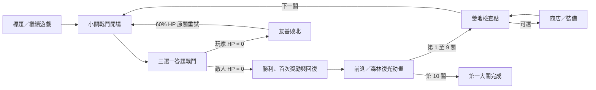
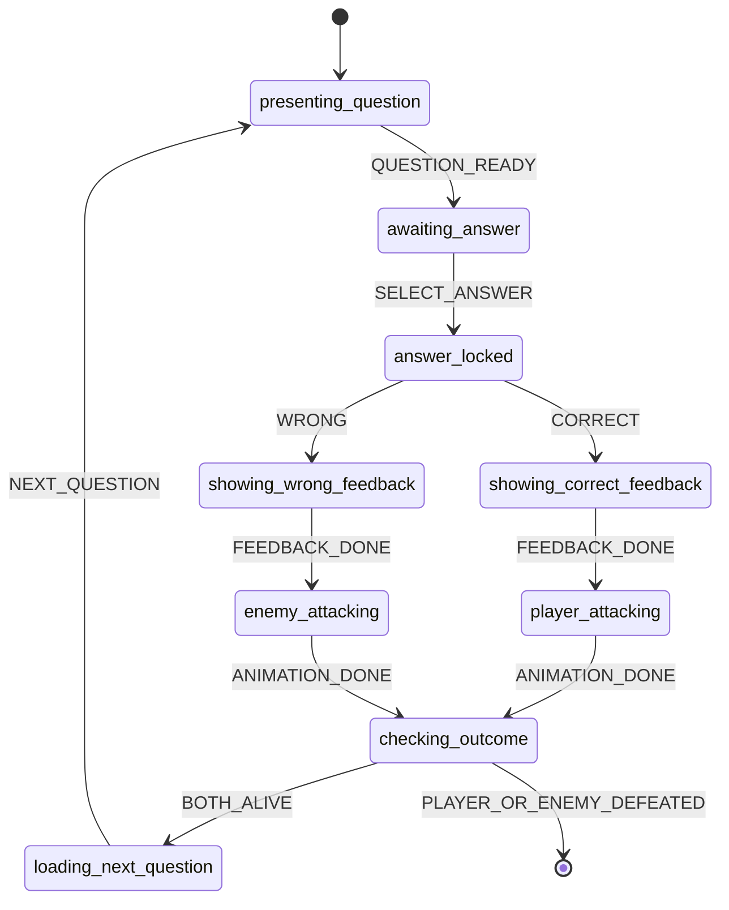

# 小三至小四數學勇者：第一大關遊戲架構

## 1. 產品範圍與關鍵決策

第一版只製作「第一大關：數字森林」，共 10 小關；第 10 小關是魔王戰。視覺語言可採原創的復古奇幻 JRPG 戰鬥構圖，但角色、怪物、名稱、圖示、音樂與介面資產都應原創，不直接重製《勇者鬥惡龍》的角色或識別元素。

每個答題回合只在畫面上呈現一題、三個選項。玩家選對就攻擊，選錯就受到攻擊；若雙方都還有 HP，載入下一題並繼續該小關。這是讓 HP、裝備、回復道具與魔王多階段演出真正產生作用的必要設計。如果把「每小關一題」解讀為整場只能有一題，則一般敵人必須一擊倒下，裝備系統幾乎只剩裝飾性，不建議第一版採用。

第一版是單機、單裝置、無登入遊戲，因此進度明確定義為「本機存檔」。不收集姓名、學校、班級或其他兒童個資，也不做排行榜或分析追蹤。

程式可直接引用 [`app/game/config.ts`](../app/game/config.ts) 的關卡、數值、商店、題庫查詢標籤與存檔型別。

## 2. 一局的玩家流程



規則摘要：

- 第 1 關首次進入前直接播放戰鬥開場，不要求玩家在地圖上移動。
- 第 1 至 9 關勝利後依序播放獎勵與前進動畫，抵達營地。玩家可進商店，也可直接進下一關。
- 第 10 關勝利後播放「森林重獲計算之光」動畫，進入第一大關完成畫面；商店仍可由完成畫面開啟。
- `currentHp` 會跨小關保留。每次勝利在發獎時回復最大 HP 的 25%，不超過最大值。
- 失敗不扣金幣、不扣道具、不重置已過關卡。原關以最大 HP 的 60% 重試，降低挫折與懲罰感。

## 3. 狀態機

### 3.1 畫面層狀態

| 狀態 | 進入事件 | 可接受的主要事件 | 離開目標 |
| --- | --- | --- | --- |
| `booting` | 應用啟動 | `SAVE_LOADED`、`SAVE_FAILED` | `title` |
| `title` | 存檔載入完成 | `START_NEW`、`CONTINUE` | `chapter-intro` 或 `battle-intro` |
| `chapter-intro` | 新遊戲首次開始 | `INTRO_DONE`、`SKIP` | `battle-intro` |
| `battle-intro` | 進入或重試小關 | `INTRO_DONE`、`SKIP` | `battle` |
| `battle` | 敵我資料與題目就緒 | `SELECT_ANSWER`、`USE_ITEM`、`PAUSE` | `victory`、`defeat`、`paused` |
| `victory` | 敵人 HP 歸零 | `REWARD_DONE` | `travel` |
| `defeat` | 玩家 HP 歸零 | `RETRY`、`RETURN_TITLE` | `battle-intro` 或 `title` |
| `travel` | 首次勝利獎勵完成 | `TRAVEL_DONE`、`SKIP` | 第 1 至 9 關為 `checkpoint`；第 10 關為 `chapter-complete` |
| `checkpoint` | 第 1 至 9 關前進動畫完成 | `OPEN_SHOP`、`CONTINUE` | `shop` 或 `battle-intro` |
| `shop` | 玩家選擇商店 | `BUY`、`EQUIP`、`USE_ITEM`、`LEAVE_SHOP` | `shop` 或開啟商店前的狀態 |
| `chapter-complete` | 魔王首次敗北 | `OPEN_SHOP`、`REPLAY`、`RETURN_TITLE` | `shop`、`battle-intro`、`title` |
| `paused` | 戰鬥中暫停 | `RESUME`、`RETURN_TITLE` | `battle` 或 `title` |
| `fatal-error` | 設定或題庫無法恢復 | `RESET_LOCAL_SAVE`、`RETRY_LOAD` | `booting` |

`paused` 應保存前一個畫面狀態；恢復時回到原本的 `battle` 與子階段，不重抽題、不改 HP。開啟 `shop` 時同樣保存 `shopReturnState`，讓第 1 至 9 關回到 `checkpoint`，魔王通關後則回到 `chapter-complete`。

### 3.2 戰鬥子狀態



實作不變量：

1. `SELECT_ANSWER` 只在 `awaiting-answer` 接受。第一次點擊或按鍵後立即同步切到 `answer-locked`，再播放任何動畫，避免雙擊造成雙重傷害。
2. 正誤判定以答案 `optionId` 比對，不以顯示文字或陣列位置比對。選項只在新題建立時洗牌一次，呈現期間不可重新排序。
3. 先套用傷害並將 HP 限制在 `0...maxHp`，再進入 `checking-outcome`。不得由動畫的 `onComplete` 重複套用傷害。
4. 首次通關獎勵必須是冪等操作：只有關卡 ID 尚未存在 `clearedLevelIds` 時，才加金幣、回復 HP 並推進存檔。
5. 題庫暫時不足時應使用經人工驗證的離線備援題，不可讓畫面卡在載入中；完全沒有可用題目才進 `fatal-error`，並顯示成人可理解的修復訊息。

## 4. 戰鬥公式與數值平衡

### 4.0 三種數學難度

玩家接受村長委託後選擇一條路線，每條路線綁定獨立的 50 題洗牌袋：簡單為國小二年級與原森林場景、普通為國小三年級與秋季場景、困難為國小四年級與古羅馬戰場。普通敵人的最大 HP 與答錯傷害為基礎值的 1.2 倍，困難為 1.3 倍，結果四捨五入為整數；簡單維持基礎值。

村長會從四枚大絕護符中隨機贈送一枚並自動配戴；普通另贈 100 金幣、困難另贈 150 金幣。所選難度會寫入版本化存檔，繼續遊戲時維持相同題庫、場景與敵人倍率。

### 4.1 玩家數值

- 初始最大 HP：100
- 基礎攻擊：26
- 基礎防禦：0
- 答對傷害：`max(1, 26 + 武器攻擊 + 飾品攻擊)`
- 答錯受傷：`max(1, 關卡答錯基礎傷害 - 護甲防禦)`
- 不使用亂數傷害、爆擊、閃避、連擊倍率或答題速度加成。孩子能清楚預期每次作答的結果。
- 回復道具不消耗答題回合，但只允許在 `awaiting-answer` 使用；動畫與判定期間不能使用。
- 裝備只在營地或商店更換。增加最大 HP 的裝備穿上時，現有 HP 同步增加相同差值；脫下時只做上限夾制，避免產生負值或額外補血漏洞。

### 4.2 十小關平衡表

「基礎答對數」是假設完全不買武器；「建議裝備答對數」假設第 2 關後使用橡木數字劍（總攻擊 33），第 5 關後使用鐵鑄算式劍（總攻擊 40）。

| 關 | 題型主軸 | 敵人 HP | 答錯傷害 | 基礎答對數 | 建議裝備答對數 | 首次金幣 |
| ---: | --- | ---: | ---: | ---: | ---: | ---: |
| 1 | 一萬以內數與位值 | 26 | 9 | 1 | 1 | 28 |
| 2 | 多次進退位加減 | 30 | 10 | 2 | 2 | 30 |
| 3 | 二、三位數乘一位數 | 34 | 11 | 2 | 2 | 34 |
| 4 | 除法、餘數、乘除互逆 | 38 | 12 | 2 | 2 | 38 |
| 5 | 長度、容量、重量 | 42 | 13 | 2 | 2 | 42 |
| 6 | 時間換算與加減 | 46 | 14 | 2 | 2 | 46 |
| 7 | 一億以內數與概數 | 50 | 15 | 2 | 2 | 50 |
| 8 | 較大位數乘除 | 56 | 16 | 3 | 2 | 56 |
| 9 | 長方形／正方形周長面積 | 64 | 18 | 3 | 2 | 65 |
| 10 | 綜合魔王 | 120 | 22 | 5 | 3 | 100 |

未裝防具、滿 HP 時，魔王第 5 次答錯才會落敗；穿學者斗篷後實傷為 15，可承受 6 次並在第 7 次落敗。正常小關約 1 至 2 次答對，魔王約 3 次答對，全章約 10 至 15 分鐘。若實測平均答對率低於 55%，優先調低答錯傷害 2 點，而不是放慢回饋或直接揭露答案。

答錯後固定顯示簡短解析，接著抽下一題。連續答錯 2 次時提供「免費觀念提示」按鈕；提示說明方法但不標示正確選項。這是學習鷹架，不應要求購買提示卷軸才能繼續。

## 5. 第 10 關魔王

魔王「混沌算龍」有 120 HP、答錯基礎傷害 22。它從混合題池抽題，涵蓋位值、加減、乘除、測量、時間與周長面積；同一領域不可連續出現兩題，且最近 12 題不得重複。

魔王在 HP 首次降到 66% 與 33% 以下時切換演出階段：

- `算式護甲崩裂`：護甲碎裂、背景亮度提高。
- `最後算式`：音樂增加節奏層、攻擊特效改色。

兩個階段只改視覺與音效，不臨時提高傷害、不縮短作答時間，也不使題目超出已標記課綱範圍。階段觸發旗標只存在本次戰鬥記憶體；重試時重設。

魔王勝利順序為：鎖住答題輸入 → 敵人 HP 歸零 → 倒下動畫 → 首次獎勵與存檔 → 森林復光動畫 → 大關完成。完成動畫可跳過，但跳過不應跳過獎勵或存檔。

## 6. 題庫接軌

國家教育研究院公布的數學領域課綱將三、四年級列在第二學習階段，並以 `N-3-*`、`N-4-*`、`S-4-*` 等代碼描述學習內容。第一大關設定使用相同代碼，例如三年級的位值、四則、測量與時間，以及四年級的大數、較大位數乘除與長方形／正方形周長面積。依據與完整條目可查閱[國家教育研究院數學領域課綱（PDF）](https://www.naer.edu.tw/upload/1/16/doc/815/%E5%8D%81%E4%BA%8C%E5%B9%B4%E5%9C%8B%E6%B0%91%E5%9F%BA%E6%9C%AC%E6%95%99%E8%82%B2%E8%AA%B2%E7%A8%8B%E7%B6%B1%E8%A6%81%E5%9C%8B%E6%B0%91%E4%B8%AD%E5%B0%8F%E5%AD%B8%E6%9A%A8%E6%99%AE%E9%80%9A%E5%9E%8B%E9%AB%98%E7%B4%9A%E4%B8%AD%E7%AD%89%E5%AD%B8%E6%A0%A1-%E6%95%B8%E5%AD%B8%E9%A0%98%E5%9F%9F.pdf)。

題庫供應端至少要提供：

```ts
interface Question {
  id: string;
  grade: 3 | 4;
  curriculumCodes: string[];
  domains: string[];
  difficulty: 1 | 2 | 3 | 4 | 5;
  prompt: string;
  options: readonly [
    { id: string; label: string },
    { id: string; label: string },
    { id: string; label: string },
  ];
  correctOptionId: string;
  explanation: string;
  conceptHint: string;
  source: { url: string; licenseOrPermission: string };
}
```

匯入規則：

- 每題必須恰好三個互異選項，只有一個正解；錯誤選項應源自常見誤解，不可只是無關亂數。
- 題目與解析均使用繁體中文；題幹避免不必要的長句、負向雙重否定與超出年齡的詞彙。
- 不直接重製有版權題庫。爬取資料必須保存來源網址與授權狀態；無再利用權限的內容只能用於分析題型，之後另行原創改寫並人工校驗。
- 每個一般小關至少 8 至 14 題，魔王混合池至少 20 題。若同一戰鬥需要下一題，先排除記憶體中的最近 12 個題目 ID。
- 不設作答倒數。題目可搭配圖，但答案不能只靠顏色辨認；圖片必須有等價文字說明。

## 7. 商店、道具與裝備

商店在每一小關首次通過後的營地可選擇進入。第一版不提供販售、抽卡、付費貨幣、每日獎勵或隨機價格。

| 類型 | 名稱 | 效果 | 價格 | 解鎖 |
| --- | --- | --- | ---: | ---: |
| 道具 | 回復藥草 | 回復 40 HP | 16 | 開始 |
| 道具 | 提示卷軸 | 顯示觀念提示 | 20 | 第 1 關後 |
| 武器 | 橡木數字劍 | 攻擊 +7 | 50 | 第 2 關後 |
| 防具 | 葉紋圓盾 | 防禦 +4 | 60 | 第 3 關後 |
| 飾品 | 森林旅靴 | 最大 HP +12 | 70 | 第 4 關後 |
| 武器 | 鐵鑄算式劍 | 攻擊 +14 | 115 | 第 5 關後 |
| 防具 | 學者斗篷 | 防禦 +7 | 110 | 第 6 關後 |
| 飾品 | 心算勇氣徽章 | 攻擊 +3、最大 HP +10 | 125 | 第 7 關後 |
| 道具 | 大回復藥草 | 回復 80 HP | 42 | 第 8 關後 |

購買交易必須依序驗證「已解鎖、未達持有上限、金幣足夠」，再以單次 state update 同時扣金幣與增加物品。裝備同一欄位只能有一件；換裝不刪除原裝備。第一版不可讓金幣、數量或 HP 變成負值。

首次全章可獲得 489 金幣，足夠購買一條合理成長路線，但不足以立刻買完所有永久裝備。重玩已通關小關不再發金幣，避免無限刷取破壞平衡。

## 8. 本機存檔策略

### 8.1 保存內容與時機

使用 `localStorage`，主鍵為 `math-hero-local-save:v1`，備份鍵為 `math-hero-local-save:backup:v1`。只保存：

- 已通過關卡、下一關、大關完成旗標。
- 玩家在營地時的 HP、金幣、持有道具與裝備。
- 音樂、音效、減少動態、高對比與文字倍率設定。

下列資料不保存：當前題目、答案順序、動畫子狀態、戰鬥中敵我 HP、答題歷史與兒童身分資料。重新整理頁面會回到目前關卡的 `battle-intro`，使用最近一次安全檢查點，避免從半段動畫或已作答題目恢復。

自動保存時機：首次通關獎勵完成、購買、使用道具、換裝、設定變更。首次通關時應先在記憶體一次算完 `clearedLevelIds + coins + healedHp + nextLevelOrder`，再保存同一份完整物件。

### 8.2 寫入與復原

1. 每次寫入前，把目前有效主存檔複製到固定備份鍵，再寫新的主存檔。
2. 載入時 `try/catch` JSON 解析，驗證 `schemaVersion`、已知關卡／物品 ID、非負整數與 HP 範圍。
3. 主存檔無效時嘗試備份；備份也無效才建立新遊戲，並顯示「本機進度需要重新開始」而不是技術錯誤堆疊。
4. 驗證時將 HP、金幣與數量限制在合理範圍；未知物品忽略，未知裝備解除裝備。
5. `QuotaExceededError` 或儲存被瀏覽器停用時，遊戲仍可在本次分頁繼續，並用非阻斷訊息提醒「這次進度可能無法保留」。
6. 提供「清除本機進度」按鈕，必須二次確認並明確說明只影響目前裝置與瀏覽器。

未來若加入跨裝置同步、家長帳號或排行榜，存檔應移到伺服器資料庫；不能把目前的本機存檔當權威帳號資料。

## 9. 手機、鍵盤與無障礙

### 9.1 觸控與版面

- 320 CSS px 寬仍不可水平捲動。手機直向時三個答案上下排列，每個答案按鈕至少 48×48 CSS px，建議高度 56 px、間距 8 px。
- 手機橫向時保留題幹、雙方 HP 與答案，不把主要操作藏進捲動底部；裝飾背景可裁切。
- 觸控使用 `pointer` 事件或標準 `click`，不依賴 hover。點擊答案後立即 disable 三個選項直到下一題。
- 不禁止瀏覽器縮放，不攔截返回手勢。音效只能在第一次明確使用者互動後啟用。

### 9.2 鍵盤

| 按鍵 | 行為 |
| --- | --- |
| `1`、`2`、`3` | 選擇對應答案 |
| `↑`／`↓` 或 `←`／`→` | 在答案間移動焦點 |
| `Enter`／`Space` | 啟用目前按鈕 |
| `Esc` | 暫停／關閉商店或對話框 |
| `M` | 切換音效靜音，並顯示可見狀態 |

數字快捷鍵只在 `awaiting-answer` 且焦點不在輸入元件時生效；按住按鍵的重複事件必須忽略。新題出現後焦點移到題目標題或題組容器，不能自動落在某個答案造成誤選。

### 9.3 語意與感官替代

- 題目使用標題與 `role="group"`，三個答案使用原生 `<button>`。HP 使用具名稱的 `<progress>` 或等價 ARIA 值，畫面同時顯示數字。
- 正誤、傷害與金幣不可只靠紅綠色區分；同時提供圖示、文字與數值。正誤回饋放在單一 `aria-live="polite"` 區域，避免多個動畫元素重複朗讀。
- 每次進入新畫面把焦點移到該畫面 `h1`；商店使用具焦點圈限的對話框。關閉後把焦點還給開啟商店的按鈕。
- 正文字級至少 18 px，行高至少 1.5；一般文字與背景對比至少 4.5:1，明顯焦點至少 3:1。
- 所有關鍵音效都有文字／動畫替代。音樂與音效可分開關閉；預設不以聲音傳達正解。
- 遵守 `prefers-reduced-motion`。減少動態時取消螢幕震動、位移與粒子，前進動畫改為不超過 200 ms 的淡入淡出；所有閃爍低於每秒 3 次。
- 不設倒數；動畫可跳過。暫停時停止音樂與時間推進，但不清除目前題目。

## 10. 整合順序

1. 建立單一 reducer，先只實作畫面層與戰鬥子狀態，不把 HP 改動散落在動畫元件。
2. 從 `CHAPTER_ONE.levels[levelIndex]` 初始化敵人，從 `questionPool` 查詢題庫；題庫與畫面以 `Question` 介面交界。
3. 實作戰鬥純函式：計算玩家傷害、敵人傷害、回復、勝負與首次獎勵。先單元測試，再接動畫。
4. 接上營地、商店、裝備與本機存檔。所有存檔都在安全檢查點發生。
5. 最後接美術資產鍵與音效鍵；缺資產時使用文字占位仍必須可完整通關。

## 11. 第一版可玩性驗收

### 設定與流程

- `CHAPTER_ONE` 恰好 10 關、順序唯一且連續，只有第 10 關 `isBoss=true`。
- 從新遊戲可依序完成 1 到 10 關；每關勝利後可進商店，也可不購物繼續。
- 第 10 關勝利只發一次 100 金幣，重新整理後仍顯示大關完成。

### 戰鬥

- 快速雙擊、觸控與鍵盤同時輸入，單題最多只造成一次傷害。
- 答對只扣敵人 HP；答錯只扣玩家 HP；所有 HP 均限制在 0 到最大值。
- 無裝備、推薦裝備、全程答對、連續答錯、戰鬥中使用回復道具與 HP 恰好歸零都要測試。
- 失敗後重試不扣金幣／物品，HP 正確設為最大值的 60%，敵人恢復滿血並載入新題。

### 商店與存檔

- 金幣不足、物品上限、重複購買永久裝備、換裝與最大 HP 變動皆有測試。
- 損毀 JSON、舊版 schema、未知物品 ID、停用 storage 與寫入額滿時仍可進入遊戲或得到可理解的復原畫面。
- 重新整理戰鬥、勝利動畫、前進動畫、商店各一次，不重複發獎、不遺失已完成關卡。

### 操作與無障礙

- 只用鍵盤可完成「開始 → 答題 → 勝利 → 進商店 → 購買 → 離店 → 下一關」。
- 在 320×568、390×844、平板與桌面尺寸無水平捲動或被遮住的主要按鈕。
- 螢幕閱讀器能朗讀題目、三選項、雙方 HP、正誤與傷害；關閉音效後仍可完整理解與通關。
- `prefers-reduced-motion` 下沒有震動與大幅位移，跳過動畫不會跳過獎勵或存檔。

## 12. 護符大絕招與敵人轉場（2026-08 選定版）

護符欄位同一時間只能裝備一枚。戰鬥中累計成功攻擊 3 次，或實際承受敵人攻擊 1 次，即取得一次大絕招充能；充能後可按下戰鬥題目區的「大絕」按鈕，施放後重新累積。答錯不會清除已累計的成功攻擊次數；護盾羽毛、蛋黃哥懶散與珍珠泡泡完全擋下的攻擊不計入「承受攻擊」。

| 護符 | 大絕招效果 | 遊戲素材 |
| --- | --- | --- |
| 蛋黃哥懶懶護符 | 立即將敵人替換成 B 款「森林嫩芽蛋黃哥」；下一次敵方攻擊會打瞌睡落空 | `public/monsters/forest-sprout-yolk-r1-f1.webp` |
| 大蔥嗆辣護符 | 啟動嗆辣二連擊，下一次答對時連續攻擊 2 次 | `public/charms/giant-leek.webp`、CSS 大絕特效 |
| 珍珠泡泡盾護符 | 產生泡泡護罩，抵擋接下來兩次答錯攻擊 | `public/charms/pearl-boba.webp`、CSS 泡泡護罩特效 |
| 橡皮擦救援護符 | 擦除一個錯誤答案，下一題暫時只剩兩個選項 | `public/charms/eraser-rescue.webp`、CSS 擦除特效 |

所有護符圖示與特效皆由多宮格素材裁切而來；B 款蛋黃哥的 4×4 格分別對應待機、眨眼搖晃、打哈欠與慵懶泡泡動作。施放時先鎖定題目輸入，再播放 Web Audio `ultimate` 音效與 CSS 特效，最後才套用效果，避免動畫重複扣血。

關卡前進採用「清除前一敵人 → 前進動畫 → 載入下一關資料 → 淡入新敵人」順序。`encounterStage` 與進度 `stage` 分離，且 travel 狀態隱藏敵人圖層，因此不會在下一關先閃出前一關的怪物。
